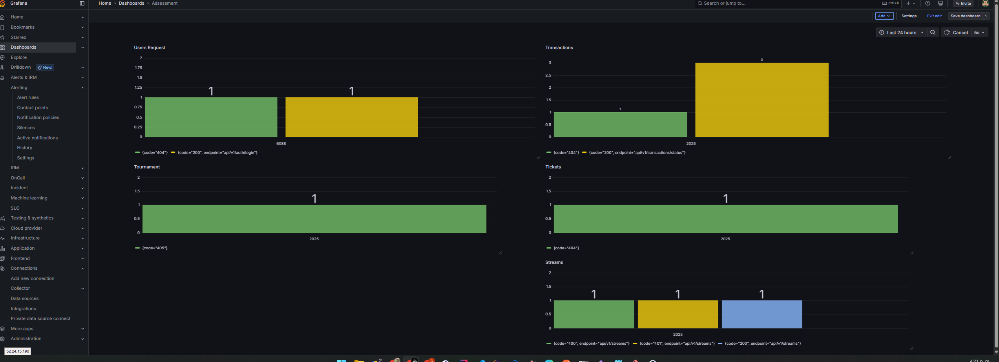

# Assessment
Este es el preview de las herramientas usadas en el stack de desarrollo, de manera local se hace uso de docker compose con todas la configuraciones necesarias para trabajar de manera local, las cuales, se listan algunas de ellas y ya la herramienta donde se despliega.

## RabbitMQ/LAVINMQ
Para el tema del broker de mensajeria se usa la plataforma [CloudAMQP](https://api.cloudamqp.com/console/d248565a-bcac-410f-8658-6c644aea6dad/details), que usa LAVINMQ, una alternativa a RabbitMQ, para acceder a la herramienta se hace por medio del siguiente enlace: [LavinMQ](https://campbell.lmq.cloudamqp.com/), por defecto al ser una herramienta gratuita, se limita la creacion de Host Virtuales, asi que se crea un virtual host que es a su vez el mismo nombre de usuario de conexion

## Neon(PostgreSQL)
Para las bases de datos, se hace uso de la plataforma [Neon](https://neon.tech/), la cual permite el aprovisionamiento de hasta 10 proyectos/bases de datos Postgres gratuitas, con el fin de tener la persistencia de datos requerida dentro de la solucion.

## Upstash(Redis)
Para cacheo de cierta informacion se hace uso de Redis de manera gratuita, dentro de la plataforma [UpStash](https://upstash.com/) que tiene una capa gratuita de la cual se puede hace uso con ciertas limitaciones, como lo son comandos ejecutados al mes, que son alrededor de 500k, un ancho de banda de 50GB, 100 conexiones y almacenamiento de 250MB, [platafoma](https://console.upstash.com/redis/15be349d-26a3-4db1-8435-84f3686cdfde?teamid=0)

## GitHub Actions
Se hace uso de GitHub Actions como alternativa gratuita de solucion DevOps, para poder desplegar las soluciones de los diferentes microservicios que fueron realizados en este proyecto, a modo de inicio, la idea seria desplegar los ms de acuerdo al Dockerfile de las solucion hacia [Render](https://render.com/), antes de desplegar las imagenes, se hacen los respectivos tests, una vez sean exitosos se hace el push de los cambios para que render haga la construccion de la imagen.

## Arquitectura

La solucion esta basada en una arquitectura  de microservicios; se compone de varios microservicios independientes, que se comunican mediante `RabbitMQ`(tanto sincrona como asincronamente), redis para cacheo de informacion, ademas, de comunicación(algunas partes) por REST API. Los servicios se exponen a traves de un `API Gateway` de forma centralizada para manejar el trafico y cierta seguridad(validacion de tokens) antes de distribuir la peticion al microservicio correspondiente.

- **Backend**: .NET8
- **Bases de datos**: PostgreSQL
- **Mensajeria**: RabbitMQ/LavinMQ
- **Cache**: Redis
- **Contenedores**: Docker(en Render)
- **Autenticacion**: JWT
- **Monitorizacion**: Prometheus + Grafana

### Microservicios
| Service      | Repository |
|--------------|------------|
|Notificaciones|[notifications_and_alerts](https://github.com/Daniel7R/notifications_alerts_MS)        |
|Usuarios y Autenticacion|[users_authorization](https://github.com/Daniel7R/UsersAuthorization_ms)   |
|Transmisiones| [streams](https://github.com/Daniel7R/streams_ms)|
|Transacciones| [transactions](https://github.com/Daniel7R/transactions_ms)|
|Torneos    | [tournaments](https://github.com/Daniel7R/tournament_ms)|
|Tickets |[tickets](https://github.com/Daniel7R/tickets_ms)|

****Leer el README dentro del repo para mas detalle****

### API Gateway
Se encarga de orquestar las peticiones entre los diferentes microservicios, se hace uso de Ocelot en .NET para la construcción de este, el repositorio de la soluciones es el siguiente:

-`API Gateway`: [ocelot_gateway_solution](https://github.com/Daniel7R/ocelot_gateway_solution)

### Bases de datos
Se usa PostgreSQL para la persistencia, cada ms tiene su propia base de datos, siguiendo el estilo **Database Per Service**, se implementan migraciones con **EF CORE**(Entity Framework).

### Comunicacion entre servicios
- **REST API**: comunicacion sincrona entre algunos ms
- **RabbitMQ**: para publicacion de eventos asincronos y sincronos con ***Req/Rep***
- **Redis**: para cache de datos con respecto a transacciones y streams 

### Monitoreo y Observabilidad

- **Prometheus+Grafana**: se recolectan metricas respecto al consumo para ver la cantidad de peticiones por endpoint y codigo de estado, para ver el comportamiento, estas metricas de consumo se exponen a traves de la libreria `prometheus-net.AspNetCore`, en el caso de Grafana, se usa la versionde prueba que son 14 dias.

[Dashboard](https://dr734659.grafana.net/public-dashboards/4f65c71481cd4720a32600b5deffeb8e)

### Despliegue y DevOps
Para el despliegue de los ms se usa `Github Actions`, en donde se realizan las pruebas unitarias, y se procede a desplegar, una vez exitosas, en la plataforma `Render`

## Contratos APIs

### Users
- [user.yaml](./contracts/UsersAuthorization/users.yaml)
- [user.json](./contracts/UsersAuthorization/users.json)

### Transactions/Payments
- [payments.yaml](./contracts/Payments/payments.yaml)
- [payments.json](./contracts/Payments/payments.json)

### Streams
- [stream.yaml](./contracts/Streams/streams.yaml)
- [stream.json](./contracts/Streams/streams.json)

### Tickets
- [tickets.yaml](./contracts/Tickets/tickets.yaml)
- [tickets.json](./contracts/Tickets/tickets.json)

### Tournaments
- [tournaments.yaml](./contracts/TournamentManagement/tournament.yaml)
- [tournaments.json](./contracts/TournamentManagement/tournament.json)

## Collection Postman

- [Collection](./collections/AssessmentRender%20Ocelot.postman_collection.json)
- [Environment](./collections/Ocelot.postman_environment.json)